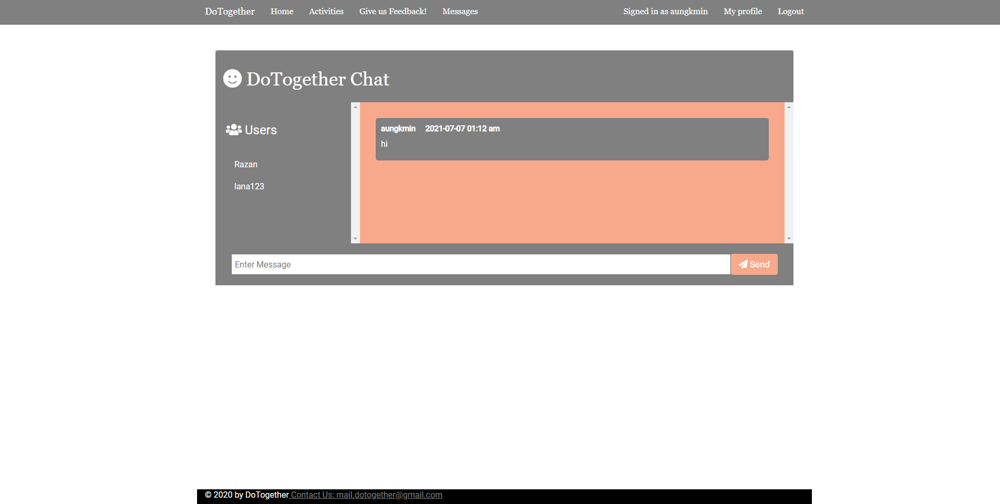

<h1>DoTogether</h1>

 

<h2> Summary </h2>

The website is built with Node.js. Routing is handled with Express (within Node.js). Websockets are handled with socket.io. The database is handled with MongoDB (service provider: MongoDB Atlas).

It is hosted on Heroku: https://dotogetherofficial.herokuapp.com/
 

Demo: https://youtu.be/3DPqrSPS6Ls 

<h2> To run locally, you need: </h2>
<ul>
	<li> MongoDB </li>
	<li> Node.js </li>
</ul>

<h2> To run: </h2>
<ol>
	<li> Run <code> npm install </code> in the repoistory directory </li> 	
	<li> Make sure you have mongod running. (Just type in mongod in another cmd window). </li>
	<li> Run <code> npm start </code> in the directory </li> 
	<li> Conenct to <code> localhost:3000 </code> using a browser </li>
</ol>

 <b> Update: </b> You will also need a config file that is not in this repoistory as it includes sensitive passwords and configuration data. Ask me about this! 

<h2> Images: </h2>

